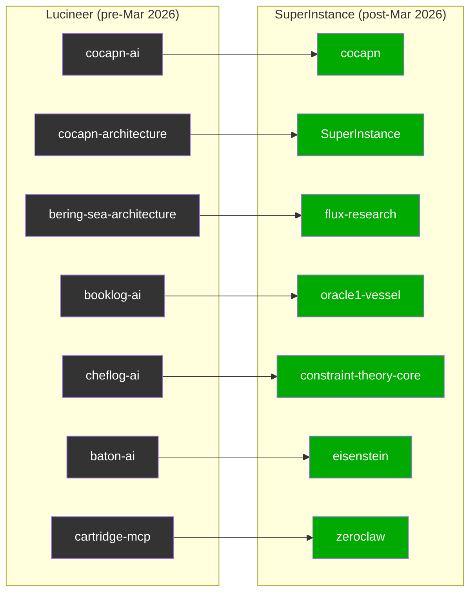

# Fleet Topology

**How the 1,700 repos connect — conceptually and architecturally.**

```mermaid
graph TB
    subgraph "Origin"
        DM[DMLog-AI<br/>Aug 2025]
    end

    subgraph "Equipment Era"
        SC[SmartCRDT]
        CE[CognitiveEngine]
        ST[Spreader-tool]
        CO[cocapn manifesto]
        ECE[Equipment-Consensus-Engine]
        EER[Equipment-Escalation-Router]
        CTC[constraint-theory-core]
    end

    subgraph "Core Fleet"
        SI[SuperInstance<br/>PLATO]
        FR[flux-research]
        FI[flux-isa]
        FV[flux-vm]
        FS[flux-site]
        FD[flux-docs]
        FM[flux-multilingual]
        FV2[flux-verify-api]
        ZC[zeroclaw]
        EI[eisenstein]
        HC[holonomy-consensus]
        P48[pythagorean48-codes]
        PVC[plato-vessel-core]
        KB[keeper-beacon]
        FHM[fleet-health-monitor]
        FR2[fleet-router]
        FC[fleet-calibrator]
        CTC2[constraint-theory-core]
    end

    subgraph "Named Vessels"
        O1[oracle1-vessel]
        O1W[oracle1-workspace]
        FM2[forgemaster]
        JC1[jc1-research]
        PRP[plato-room-phi]
        PT[plato-types]
        PD[plato-data]
        PMB[plato-matrix-bridge]
        PMCP[plato-mcp]
        PTR[plato-training]
        PNG[plato-ng]
        PC[platoclaw]
        PSB[plato-shell-bridge]
        PTL[plato-tile-library]
        PE[plato-experience]
        PW[plato-watch]
    end

    subgraph "Integration Bridges"
        OS[OpenShell]
        TA[terax-ai]
        TG[terax-gateway]
        ME[MemEye]
        OA[openarm]
        OH[openhuman]
        AM[automerge]
        DG[DeepGEMM]
    end

    subgraph "Experimental"
        FF[friendly-fox]
        CON[construct]
        INC[incubator]
        SM[servo-mind]
        SMT[servo-mind-theory]
        DFA[dog-food-audit]
        PM[penrose-memory]
        NP[neural-plato]
        TS[tensor-spline]
    end

    DM --> SC
    DM --> CE
    DM --> CO
    SC --> CTC
    CE --> ECE
    ST --> SI
    CO --> SI
    ECE --> HC
    EER --> FR2
    CTC --> EI
    CTC --> P48
    CTC --> FM2

    SI --> FR
    FR --> FI
    FR --> FV
    FR --> FS
    FR --> FD
    FR --> FM
    FR --> FV2
    SI --> ZC
    SI --> CTC2
    EI --> PVC
    HC --> KB
    FR2 --> FHM
    FR2 --> FC

    SI --> O1
    SI --> O1W
    CTC2 --> FM2
    JC1 --> PVC
    SI --> PRP
    SI --> PT
    SI --> PD
    SI --> PMB
    SI --> PMCP
    SI --> PTR
    SI --> PNG
    SI --> PC
    SI --> PSB
    SI --> PTL
    SI --> PE
    SI --> PW

    SI --> OS
    SI --> TA
    TA --> TG
    SI --> ME
    SI --> OA
    SI --> OH
    SC --> AM
    DG --> JC1

    SI --> FF
    SI --> CON
    SI --> INC
    SI --> SM
    SI --> SMT
    SI --> DFA
    SI --> PM
    SI --> NP
    EI --> TS
```



---

## Layer Model

```
┌─────────────────────────────────────────┐
│  Integration Layer (8 repos)            │
│  OpenShell · Terax · MemEye · openarm   │
├─────────────────────────────────────────┤
│  Named Vessels Layer (16 repos)         │
│  Oracle1 · Forgemaster · JC1 · Plato    │
├─────────────────────────────────────────┤
│  Core Fleet Layer (20 repos)            │
│  PLATO · FLUX · ZeroClaw · Constraints  │
├─────────────────────────────────────────┤
│  Equipment Layer (7 repos)              │
│  CRDT · Tiling · Routing · Consensus    │
├─────────────────────────────────────────┤
│  Origin Layer (1 repo)                  │
│  DMLog-AI — the first commit            │
└─────────────────────────────────────────┘
```

---

## Lucineer Migration



---

## Signal Flow

```
ZeroClaw Agents (12 types)
        ↓ tiles every 5 min
PLATO Room System
        ↓ aggregates + gates
Fleet Health Monitor
        ↓ alerts + routing
Named Vessels (Oracle1, FM, JC1, CCC)
        ↓ action + build
Integration Targets (OpenShell, Terax, MemEye)
        ↓ external world
```

---

*Last updated: 2026-05-21*
