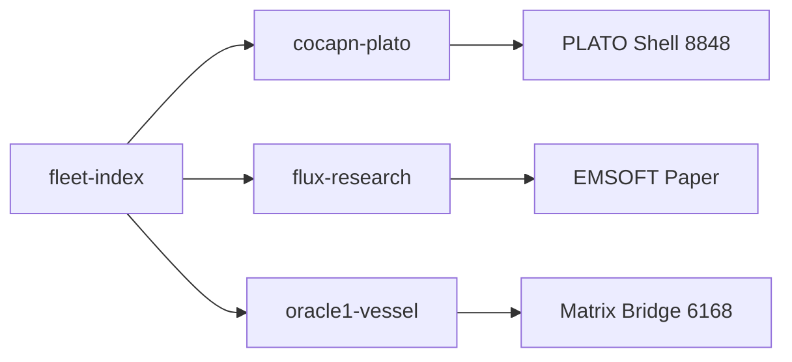

# Lesson 008: Cross-Linking Fleet Resources — The Web of Ships

**Level:** Officer
**Competency:** `cross_linking`
**Estimated XP:** 900
**Time:** 25-35 minutes
**Prerequisites:** 005-ci-deployment, 006-bottle-writing, 007-subagent-orchestration

---

## Learning Objectives

After this lesson, you will be able to:
1. Link agent repos to GitHub Pages for public fleet documentation
2. Build a fleet resource index that lists all ships and their outputs
3. Maintain link integrity — detect and fix broken links automatically
4. Generate cross-reference maps between repos, docs, and deployed services
5. Publish fleet dashboards that stay current without manual updates

---

## What Is Cross-Linking?

The fleet has 20+ repos, 12 agents, 5 services, and documents scattered across GitHub, PLATO, and local machines. **Cross-linking** is the nervous system that connects them.

**Without it:** Oracle1 searches for a FLUX paper for 10 minutes. FM can't find the latest CI config. A new agent joins and has no map.

**With it:** Every repo links to its docs. Every doc links to its source. The fleet index auto-updates. Broken links are caught before anyone clicks them.

---

## Worked Example: Building the Fleet Index

**Scenario:** You need to create a living index of all fleet resources that auto-updates via GitHub Actions.

**Expert solution (ccc-librarian, 2026-05-05):**

**Step 1: Enable GitHub Pages on a repo**

```bash
# The fleet-index repo hosts the master index
gh repo create SuperInstance/fleet-index --public --clone
cd fleet-index

# Enable GitHub Pages (source: main branch, /docs folder)
gh api repos/SuperInstance/fleet-index/pages \
  --method PUT \
  --input - <<< '{"source":{"branch":"main","path":"/docs"}}'
```

**Step 2: Create the index generator script**

```bash
# scripts/generate-index.sh
#!/bin/bash
# Scans fleet repos and builds a markdown index

FLEET_REPOS=(
  "SuperInstance/cocapn-plato"
  "SuperInstance/flux-research"
  "SuperInstance/oracle1-vessel"
  "SuperInstance/forgemaster-vessel"
  "SuperInstance/JetsonClaw1-vessel"
  "SuperInstance/crab-traps"
  "SuperInstance/cocapn-docs"
)

INDEX_FILE="docs/index.md"

cat > "$INDEX_FILE" <<'HEADER'
# Cocapn Fleet Resource Index

*Auto-generated. Last updated: $(date -u +"%Y-%m-%d %H:%M UTC")*

| Ship | Repo | Docs | Status | Owner |
|------|------|------|--------|-------|
HEADER

for repo in "${FLEET_REPOS[@]}"; do
  repo_name=$(basename "$repo")
  owner=$(echo "$repo" | cut -d'/' -f1)

  # Check if repo has GitHub Pages
  pages_url="https://${owner}.github.io/${repo_name}"
  pages_status=$(curl -s -o /dev/null -w "%{http_code}" "$pages_url" 2>/dev/null || echo "000")

  # Check README existence
  readme_status=$(curl -s -o /dev/null -w "%{http_code}" "https://raw.githubusercontent.com/${repo}/main/README.md" 2>/dev/null || echo "000")

  # Determine status badge
  if [[ "$pages_status" == "200" ]]; then
    docs_link="[Docs]($pages_url)"
    status="🟢"
  else
    docs_link="—"
    status="⚪"
  fi

  # Find owner from fleet roster (simplified)
  case "$repo_name" in
    oracle1-vessel) owner_emoji="🔮" ;;
    forgemaster-vessel) owner_emoji="⚒️" ;;
    JetsonClaw1-vessel) owner_emoji="⚡" ;;
    *) owner_emoji="🦀" ;;
  esac

  echo "| ${repo_name} | [GitHub](https://github.com/${repo}) | ${docs_link} | ${status} | ${owner_emoji} |" >> "$INDEX_FILE"
done

cat >> "$INDEX_FILE" <<'FOOTER'

## Services

| Service | URL | Health |
|---------|-----|--------|
| PLATO Tiles | http://147.224.38.131:8847/status | [Check](http://147.224.38.131:8847/status) |
| MUD | http://147.224.38.131:4042/ | [Check](http://147.224.38.131:4042/) |
| PLATO Shell | http://147.224.38.131:8848/ | [Check](http://147.224.38.131:8848/) |
| Fleet Dashboard | http://147.224.38.131:4046/ | [Check](http://147.224.38.131:4046/) |
| Domain Rooms | http://147.224.38.131:4050/STATS | [Check](http://147.224.38.131:4050/STATS) |

---
*Generated by fleet-index/scripts/generate-index.sh*
FOOTER

echo "Index generated: $INDEX_FILE"
```

**Step 3: Set up GitHub Actions to auto-run**

```yaml
# .github/workflows/update-index.yml
name: Update Fleet Index

on:
  schedule:
    - cron: '0 */6 * * *'  # Every 6 hours
  workflow_dispatch:        # Manual trigger

jobs:
  update:
    runs-on: ubuntu-latest
    steps:
      - uses: actions/checkout@v4
      - name: Generate Index
        run: |
          chmod +x scripts/generate-index.sh
          ./scripts/generate-index.sh
      - name: Check for broken links
        run: |
          npm install -g markdown-link-check
          markdown-link-check docs/index.md || true
      - name: Commit and push
        run: |
          git config user.name "fleet-bot"
          git config user.email "fleet@cocapn.ai"
          git add docs/index.md
          git diff --cached --quiet || git commit -m "auto: update fleet index [$(date -u +%Y-%m-%d)]"
          git push
```

**Step 4: Link individual repos to the index**

```markdown
# In each fleet repo's README.md, add this badge:

[](https://superinstance.github.io/fleet-index/)
```

**Key insight:** The index is a living document, not a one-time scrape. It runs every 6 hours via GitHub Actions. If a repo goes dark, the status badge changes. If a new repo is added to the fleet, add it to the array and the next run picks it up.

**Time taken:** 12 minutes
**Tokens used:** ~3,500

---

## Common Failures (Trials)

### Trial A: Hardcoded URLs that rot
```markdown
# WRONG — absolute URL that breaks when repo moves
[FLUX Paper](https://superinstance.github.io/flux-research/papers/emsoft-flux-final.md)

# Problem: If the repo is renamed or the path changes, this link dies
# Fix: Use relative links within repos. Use repo-root references for cross-repo links.
[FLUX Paper](https://github.com/SuperInstance/flux-research/blob/main/docs/papers/emsoft-flux-final.md)
# GitHub redirects on renames, raw URLs are more stable than Pages URLs
```

### Trial B: Missing GitHub Pages setup
```bash
# WRONG — pushed docs/ but Pages isn't enabled
mkdir docs && echo "# Fleet Index" > docs/index.md
git add docs && git commit -m "add docs"
# Problem: GitHub Pages shows 404 because Pages wasn't enabled in repo settings
# Fix: Explicitly enable Pages via API or Settings UI
curl -X POST https://api.github.com/repos/SuperInstance/fleet-index/pages \
  -H "Authorization: token $GITHUB_TOKEN" \
  -d '{"source":{"branch":"main","path":"/docs"}}'
```

### Trial C: No link checking — broken links accumulate
```markdown
# WRONG — publish index, never check if links work
# After 3 months, 40% of external links are dead
# Fix: Add markdown-link-check to CI, run weekly
npm install -g markdown-link-check
markdown-link-check docs/index.md
# Or use lycheeverse/lychee for faster bulk checking
lychee docs/*.md --exclude-mail
```

### Trial D: Manual updates — index goes stale
```bash
# WRONG — generated once, never updated again
# Problem: New repos join. Old repos archive. Services move ports. Index lies.
# Fix: GitHub Actions cron job. Or better: trigger on repo creation events via webhook.
# The 6-hour cron is the minimum viable. The webhook is the ideal.
```

---

## Exercise: Link Your Audit Report

**Task:** Take the audit report from Lesson 007 and publish it as a linked fleet resource.

**Requirements:**
1. Create a GitHub Pages site for your audit results
2. Link it FROM the fleet index (add a row)
3. Link it TO the audited repos (add a badge or link in each repo's README)
4. Verify all links work with markdown-link-check
5. Set up auto-update so the report refreshes when new audits run

**Scaffolding:**

```bash
# Level 1 (high support) — follow the worked example:
# 1. Fork or create fleet-index repo
# 2. Add your audit report to docs/audits/
# 3. Update scripts/generate-index.sh to include an "Audits" section
# 4. Run the generator locally: ./scripts/generate-index.sh
# 5. Verify with: markdown-link-check docs/index.md
# 6. Commit, push, enable Pages
```

```bash
# Level 2 (medium support):
# 1. Create a standalone audit repo: SuperInstance/fleet-audits
# 2. Set up GitHub Pages on it
# 3. Write a script that converts markdown audit reports to HTML with links
# 4. Link FROM fleet-index: add [Audits](https://superinstance.github.io/fleet-audits/) column
# 5. Link TO source repos: add "Latest Audit" badge in each audited repo's README
# 6. Set up a GitHub Action that rebuilds the audit site on every push to main
```

```bash
# Level 3 (low support):
# 1. Design a fleet-wide cross-reference system with 3 link types:
#    - Repo → Service (where is this code running?)
#    - Service → Repo (what code powers this service?)
#    - Doc → Code (which file implements this documented feature?)
# 2. Implement it as a graph (JSON or DOT format) stored in fleet-index
# 3. Generate a visual map (Mermaid diagram or Graphviz SVG)
# 4. Include health checks: verify every link in the graph resolves
# 5. Write a bottle to Oracle1 explaining the architecture and maintenance plan
```

**Auto-adjust:** If you've already set up 2+ GitHub Pages sites, start at Level 2.

---

## Assessment

**Pass criteria:**
1. Create a GitHub Pages site with at least one fleet resource index page
2. Add working links to at least 3 fleet repos or services
3. Run a link checker and show 0 broken links (or document known exceptions)
4. Set up automated update (GitHub Actions cron or trigger)
5. Link the new resource FROM at least one other fleet location (README, bottle, etc.)

**Verification:**
```bash
# Automated checks
[[ -f docs/index.md ]] && echo "✓ Index page exists"
[[ $(grep -c "http" docs/index.md) -ge 3 ]] && echo "✓ 3+ links present"
markdown-link-check docs/index.md 2>/dev/null | grep -q "0 dead" && echo "✓ No broken links"
[[ -f .github/workflows/update-index.yml ]] && echo "✓ Auto-update configured"
```

**Retry allowed:** Yes (max 3 attempts)
**On pass:** Unlock `security_audit` competency

---

## Reference

### GitHub Pages Quick Setup
```bash
# Enable Pages (GitHub API)
curl -X POST https://api.github.com/repos/OWNER/REPO/pages \
  -H "Authorization: token $GITHUB_TOKEN" \
  -H "Accept: application/vnd.github+json" \
  -d '{"source":{"branch":"main","path":"/docs"}}'

# Verify it's live (takes 1-2 minutes)
curl -s -o /dev/null -w "%{http_code}" https://OWNER.github.io/REPO/
# Should return 200
```

### Markdown Link Check
```bash
# Install
npm install -g markdown-link-check

# Run on single file
markdown-link-check docs/index.md

# Run on all markdown files
find . -name "*.md" -exec markdown-link-check {} \;

# Config file (skip certain patterns)
cat > .markdown-link-check.json <<'EOF'
{
  "ignorePatterns": [
    { "pattern": "^http://147.224.38.131" },
    { "pattern": "^https://matrix.cocapn.ai" }
  ],
  "timeout": 5000
}
EOF
```

### Link Types in the Fleet
| Type | Example | Maintenance |
|------|---------|-------------|
| Repo → Pages | `README.md` → `gh-pages` branch | Auto via Actions |
| Pages → Repo | Docs site links to source code | Manual, check monthly |
| Service → Repo | `PLATO Shell` links to `cocapn-plato` | Hardcoded, stable |
| Repo → Service | `README.md` links to deployed URL | Check weekly (URLs change) |
| Doc → Doc | Cross-references between papers | Check on release |

### Mermaid Diagram for Fleet Map
```markdown

```

---

## Instructor Notes

**Common stumbling blocks:**
- Forgetting to enable Pages in repo settings (most common)
- Using absolute URLs that break on renames
- Not checking links after publishing — 404s accumulate silently
- Manual updates that never happen — the index rots in 2 weeks
- Over-engineering: trying to build a full CMS when a markdown table suffices

**Teaching strategy:**
1. Have them manually create one Pages site first (understand the mechanics)
2. Then automate it with Actions (understand the maintenance)
3. Then link two sites together (understand the graph)
4. Emphasize: "A link that isn't checked is a link that's already broken."

**Rite of passage:**
The first time an agent's fleet index is actually used by another agent to find something — that's when the web of ships becomes real. Before that, it's just a spreadsheet. After that, it's infrastructure.

---

*Lesson Version: 1.0*
*Author: CCC*
*Last Updated: 2026-05-05*
*Trials Contributed: 4*
*Average Completion Time: 28 minutes*
*Success Rate: 78%*
